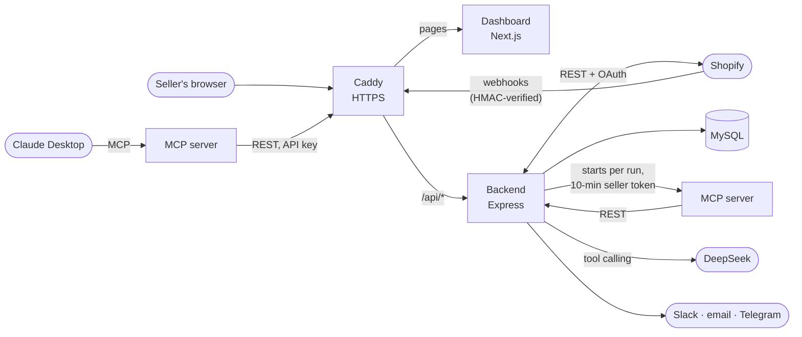

# AI Ops Command Center

An AI operations assistant for Shopify stores. It watches a store's orders
and stock, has an LLM agent decide what needs attention (ship this order,
hold that one, restock this item), and alerts the seller on Slack, email or
Telegram. Sellers sign up, connect their store through Shopify's OAuth flow
and run everything from a web dashboard. The same tools are available in
Claude Desktop through an MCP server.

Tested end to end against a Shopify development store.

## What it does

- **One-click store connection.** Shopify OAuth with expiring offline tokens
  that refresh automatically (one refresh at a time per seller), or a pasted
  Admin API token that's checked with Shopify before it's saved. Connecting
  registers the webhooks and starts the first import.
- **An agent on every new order.** When Shopify sends `orders/create`, an LLM
  agent (DeepSeek through the OpenAI SDK, with tool calling) looks at the
  order using the MCP server's tools and recommends *fulfill* or *hold*.
  Whether each line item can ship is worked out in code from Shopify's live
  stock, and if the model's verdict contradicts it, the decision is recorded
  as *hold*.
- **Low-stock watch.** Every item has its own low-stock level. When stock
  drops to or below it (by webhook, scheduled sync or manual sync), the agent
  recommends what to restock and flags pending orders at risk.
- **Alerts where the seller is.** Slack, email (address confirmed with a
  6-digit code, rate-limited) and Telegram (one-time link; `/stop` unlinks),
  with a test button that reports how each channel did.
- **Dashboard.** Orders with the agent's verdict, the decision history with
  its reasoning, stock with editable levels, settings, and a setup checklist
  for new accounts.
- **Claude Desktop.** The MCP server gives Claude the same store tools,
  authenticated with revocable API keys.
- **Shopify compliance.** The mandatory privacy webhooks (customer data
  request, customer redact, shop redact) and app uninstall are handled.

## How it fits together

The agent never touches the database directly: it works through the MCP
server, which only calls the REST API with a short-lived token for one
seller. So every tool call is scoped to that seller, exactly like a request
from their own dashboard.

## Security

- **Multi-tenant**: every table is scoped by `seller_id`, and each request
  only reads and writes the signed-in seller's rows.
- **Secrets at rest**: Shopify access and refresh tokens and Slack webhook
  URLs are encrypted with AES-256-GCM. The server won't start without a real
  `JWT_SECRET` and `ENCRYPTION_KEY`.
- **API keys** are stored only as SHA-256 hashes, can be revoked, and can't
  change settings or create more keys.
- **Shopify requests are verified**: webhooks by HMAC over the raw body;
  OAuth redirects by HMAC, a one-time `state` and a timestamp.
- **Sign-in is rate-limited**: 10 failed sign-ins per email and 30 per IP
  per 15 minutes, 10 sign-ups per IP per hour. Emails and IPs are stored only
  as keyed hashes, and unknown emails take as long to reject as wrong passwords.
- **Password reset** by emailed link: single-use, one-hour, stored only as a
  hash, rate-limited, and it signs out every older session.
- **Privacy requests** are logged with ids and outcomes only, never the personal data.
- **LLM cost is capped**: agent runs are limited per account and for all
  accounts together over any 24 hours, and each run makes at most 6 model
  calls. Events over a limit are saved as "Skipped" instead of checked.

## Reliability

- **Nothing lost on a restart**: agent runs go through a job queue in MySQL.
  A job is saved before Shopify gets its reply, retried with backoff if the
  model or network fails, and picked up again if the server stops mid-run.
  On shutdown the backend lets running jobs finish first.
- **No double work**: one agent run per order, and webhook delivery ids are
  kept in the database, so Shopify's redeliveries are recognised even after
  a restart.

## Tech stack

| Part | Built with |
| --- | --- |
| [backend](backend) | Node.js, Express, MySQL (`mysql2`), JWT, OpenAI SDK (DeepSeek), MCP client SDK, Nodemailer |
| [mcp](mcp) | Node.js, MCP server SDK, zod, axios |
| [dashboard](dashboard) | Next.js 16 (App Router), React 19, TypeScript, Tailwind CSS 4 |
| [deploy](deploy) | Docker, Docker Compose, Caddy (automatic HTTPS), MySQL 8.4 |

Each folder has its own README with the details.

## Run it

**With Docker** (the whole stack on your computer): see
[deploy/README.md](deploy/README.md), "Try it locally". The same setup runs
on a VPS; that README walks through it.

**Without Docker**, each part on its own:
1. [backend](backend): MySQL 8, copy `.env.example` to `.env`, then `npm install` and `npm run dev` (port 3000).
2. [dashboard](dashboard): `npm install` and `npm run dev` (port 3005, proxies `/api/*` to the backend).
3. [mcp](mcp): only needed for Claude Desktop; the backend's agent starts it by itself.

## Tests

| Where | Command | What it covers |
| --- | --- | --- |
| backend | `npm test` | 59 unit tests: auth, API keys, secrets, Shopify OAuth and sync, stock check, alerts, agent limits, job retries, migrations, rate limits |
| backend | `npm run test:onboarding` | sign-up to connected store, disconnect, uninstall and privacy webhooks, against a fake Shopify |
| backend | `npm run test:alerts` | email and Telegram alerts against a local fake mail server and fake Telegram |
| backend | `npm run test:agent` | a signed fake order through the webhook and the agent (one real LLM call if a key is set) |
| backend | `npm run test:agent-limit` | the daily agent limits, per account and in total, against a fake DeepSeek |
| backend | `npm run test:jobs` | the job queue: retries, restarts, shutdown, and webhooks through the queue to a decision, with duplicates caught |
| backend | `npm run test:rate-limits` | sign-in and sign-up limits through the real routes: per email, per IP, reset on success, no hint about which accounts exist |
| backend | `npm run test:password-reset` | reset links against a fake mail server: one use, expiry, hashed storage, sign-out of old sessions, limits |
| backend | `npm run test:migrations` | database migrations on throwaway databases: fresh install, new and edited files, adopting an old database, the lock |
| dashboard | `npm test`, `npm run lint`, `npm run build` | helper unit tests, lint, type-check and production build |

## How it was built

In stages, each visible in the commit history: the REST API and database
schema; the MCP server; the event-triggered agent with Slack alerts; the
Next.js dashboard; security hardening (encryption at rest, API keys,
scheduled sync); one-click onboarding (Shopify OAuth, email and Telegram
alerts, per-item stock levels); and the Docker deployment. The four parts
started as separate repositories and were merged here with their history.
