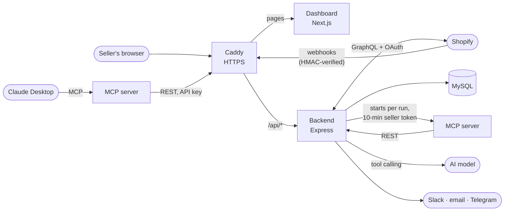

# Arbiter Ops

(Formerly AI Ops Command Center; the repository keeps that name.)

An AI operations assistant for Shopify stores. It watches a store's orders
and stock, has an LLM agent decide what needs attention (ship this order,
hold that one, restock this item), and alerts the seller on Slack, email or
Telegram. Sellers sign up, connect their store through Shopify's OAuth flow
and run everything from a web dashboard. The same tools are available in
Claude Desktop through an MCP server.

Tested end to end against a Shopify development store. Live at
https://aiops-cocenter.site: press **Try the demo** on the sign-in page
for a sample store of your own (no account needed; sign-up is invite-only
for now).

## What it does

- **One-click store connection.** Shopify OAuth with expiring offline tokens
  that refresh automatically (one refresh at a time per seller), or a pasted
  Admin API token that's checked with Shopify before it's saved. Connecting
  registers the webhooks and starts the first import.
- **An agent on every new order.** When Shopify sends `orders/create`, an LLM
  agent (OpenAI's gpt-5-nano through the OpenAI SDK, with tool calling) looks at the
  order using the MCP server's tools and recommends *fulfill* or *hold*.
  Whether each line item can ship is worked out in code from Shopify's live
  stock, and if the model's verdict contradicts it, the decision is recorded
  as *hold*.
- **Fraud risk.** Each order's run reads Shopify's fraud analysis: the worst
  risk level from Shopify and any fraud app, Shopify's recommendation and the
  reasons, and whether the billing and shipping addresses match. High risk
  (or "cancel") is a *hold* the model can't overrule; medium risk is a hold
  unless the seller's notes say otherwise. A run waits up to 10 minutes for a
  pending analysis. When Shopify or a fraud app changes an order's assessment
  later, Shopify's `orders/risk_assessment_changed` webhook has it read again
  at once (each sync also re-checks recent open orders, in case one was
  missed): if the risk went up after the agent decided, the seller gets an
  alert in seconds.
- **Hold and fulfill in Shopify.** From an order's page the seller puts it on
  a real Shopify hold (with a reason), releases it, or marks it shipped with
  a tracking number and an email to the customer. With auto-hold switched on,
  the agent's *hold* becomes a Shopify hold by itself (it never ships
  anything). Only what Shopify allows right now is offered, only this app's
  own holds are released, and every attempt is logged with Shopify's answer.
  The same works from the alert itself: order alerts in Slack and email link
  to a page that shows the order as Shopify has it and confirms before
  acting, and Telegram asks "Yes / Cancel" in the chat.
- **Low-stock watch.** Every item has its own low-stock level. When stock
  drops to or below it (by webhook, scheduled sync or manual sync), the agent
  recommends what to restock and flags pending orders at risk.
- **Restock forecasts.** From stored order line items, worked out in code:
  how fast each item sells, when it runs out and how many to reorder (e.g.
  "runs out in about 4 days, reorder 40"), always with how much order history
  that's based on, and flagged as rough when that's under 3 orders or a week.
  On the Stock page, in low-stock alerts, and as an MCP tool.
- **Alerts where the seller is.** Slack, email (address confirmed with a
  6-digit code, rate-limited) and Telegram (one-time link; `/stop` unlinks),
  with a test button that reports how each channel did. Every decision alert
  has Right call / Wrong call buttons: one tap in Telegram (a reply adds the
  note), a signed, expiring rating page from Slack and email.
- **Daily summary and late orders.** At an hour the seller picks, in their
  time zone: yesterday's orders and sales against the day before, what needs
  action, orders flagged for fraud, stock running out and the agent's
  decisions. Separately, an alert when a paid order still isn't shipped
  after 12-72 hours, once per order.
  Queued as jobs with keys, so each is sent exactly once.
- **Dashboard.** A side navigation with live counts and a top bar with the
  store, order search (Ctrl K) and Sync. An overview of the last 7, 14 or 30
  days against the same stretch before (orders, sales, what needs action,
  orders flagged for fraud, the orders waiting on you with the agent's call on
  each, what runs out soon, the agent's accuracy), orders with the agent's
  verdict and fraud risk (tabs with counts, searchable, filterable, paginated,
  each with its own page: the agent's call and rating, fraud signals, hold and
  fulfill in Shopify, line items and a timeline), the decision history with
  its reasoning and the seller's notes it learns from, stock with days-left
  bars, editable levels, restock forecasts and a CSV reorder list, settings,
  and a setup checklist for new accounts.
- **Is the agent right?** The seller rates each decision thumbs up or down,
  with an optional note on what it should have done. The Decisions page shows
  the share rated right (overall and per verdict) and filters for what's not
  rated yet or marked wrong; the Overview shows it for the last 7 days.
- **An agent that learns the store.** Before each decision the agent reads
  the seller's recent wrong-call ratings and notes on similar events (e.g.
  "bank transfers always show pending first; ship them"), applies them where
  they fit and says when one changed its call. The stock check still has the
  final word.
- **Claude Desktop.** The MCP server gives Claude the same store tools,
  authenticated with revocable API keys, plus two for the seller only: read
  the agent's decisions and rate them ("that #1001 call was wrong: bank
  transfers show pending first"), which the agent learns from.
- **Chat in the dashboard.** The seller asks about their store in their own
  words ("what needs to ship today?", "which items run out this week?") and
  gets an answer from their data, read with the agent's own MCP tools plus
  the decision history. Read-only, order numbers link to the order, and the
  conversation stays in the browser tab.
- **A demo anyone can try.** "Try the demo" gives each visitor their own
  sample store: a month of orders, fraud checks, the agent's decisions (some
  rated, one marked wrong with the note it learns from), stock forecasts and
  a late order. Hold, release and fulfill work against a stand-in for Shopify
  built from the demo's own tables. It never calls Shopify or the model,
  can't connect a store or send messages, and is deleted after 4 hours.
- **Shopify compliance.** The mandatory privacy webhooks (customer data
  request, customer redact, shop redact) and app uninstall are handled, and
  a privacy policy page (`/privacy`) says what is kept and shared, as the
  code does it; the operator's name and contact come from settings.

## How it fits together

```mermaid
flowchart LR
  seller([Seller's browser]) --> caddy[Caddy<br/>HTTPS]
  caddy -- "pages" --> dash[Dashboard<br/>Next.js]
  caddy -- "/api/*" --> api[Backend<br/>Express]
  shopify([Shopify]) -- "webhooks<br/>(HMAC-verified)" --> caddy
  api <-- "GraphQL + OAuth" --> shopify
  api --> db[(MySQL)]
  api -- "starts per run,<br/>10-min seller token" --> mcp[MCP server]
  mcp -- "REST" --> api
  api -- "tool calling" --> llm([AI model])
  api --> alerts([Slack · email · Telegram])
  claude([Claude Desktop]) -- "MCP" --> mcp2[MCP server] -- "REST, API key" --> caddy
```

The agent never touches the database directly: it works through the MCP
server, which only calls the REST API with a short-lived token for one
seller. So every tool call is scoped to that seller, exactly like a request
from their own dashboard.

## Security

- **Multi-tenant**: every table is scoped by `seller_id`, and each request
  only reads and writes the signed-in seller's rows.
- **Secrets at rest**: Shopify access and refresh tokens and Slack webhook
  URLs are encrypted with AES-256-GCM. The server won't start without a real
  `JWT_SECRET` and `ENCRYPTION_KEY`.
- **API keys** are stored only as SHA-256 hashes, can be revoked, and can't
  change settings, create more keys, or hold and ship orders.
- **Links in alerts act on one thing only**: a rating link rates one decision;
  a hold or fulfill link is signed for one order and one action (its own
  HMAC key), expires after 7 days, and never acts when opened, only when
  confirmed on the page (mail scanners open links by themselves). Telegram's
  buttons only work from the chat linked to the order's account.
- **Shopify requests are verified**: webhooks by HMAC over the raw body;
  OAuth redirects by HMAC, a one-time `state` and a timestamp.
- **Demo accounts are sealed off**: no password (sign-in is a token that
  expires with the account), no real store, no model calls (the agent
  refuses to run for one), and anything that reaches outside (connecting a
  store, alert channels, API keys, sending a summary) is refused. At most 10
  per address an hour and 200 at once; each is deleted with its data when it
  expires.
- **Sign-up can be invite-only**: set `SIGNUP_INVITE_CODE` and creating an
  account needs that code (wrong guesses are rate-limited), so strangers can't
  connect stores and spend LLM credits before you're ready. A seller who
  installs their app from Shopify's install link brings a signed install
  ticket for their store instead, so they never see the code.
- **Each real seller has a Shopify app of their own** (custom distribution
  installs an app on one store): its client ID and secret are stored per
  store, encrypted, and used for that store's approval, webhooks and token
  refreshes. [docs/ADD-A-SELLER.md](docs/ADD-A-SELLER.md) is the five-minute
  routine per seller; the seller only opens a link and signs up.
- **Sign-in is rate-limited**: 10 failed sign-ins per email and 30 per IP
  per 15 minutes, 10 sign-ups per IP per hour. Emails and IPs are stored only
  as keyed hashes, and unknown emails take as long to reject as wrong passwords.
- **Password reset** by emailed link: single-use, one-hour, stored only as a
  hash, rate-limited, and it signs out every older session.
- **Privacy requests** are logged with ids and outcomes only, never the personal data.
- **Sellers can delete their account** from Settings, after entering their
  password again (wrong ones count toward the sign-in limit): the app is
  uninstalled from their store and everything kept for them is deleted.
- **LLM cost is capped**: agent runs are limited per account and for all
  accounts together over any 24 hours, and each run makes at most 6 model
  calls. Events over a limit are saved as "Skipped" instead of checked.
  Chat questions have their own daily caps (40 per account, 400 in total by
  default), so chatting never uses up the checks new orders need.

## Reliability

- **The operator hears about problems first**: a job that failed for good,
  a store whose sync fails 3 times in a row, a store disconnected because
  Shopify refused its token refresh, a failing webhook, the agent's total
  cap, and every backend start go to `OPS_ALERT_EMAIL` and/or
  `OPS_ALERT_TELEGRAM_CHAT_ID`, each kind at most once an hour.
  `/api/health` (which also checks the database) is for an uptime monitor.
- **Nothing lost on a restart**: agent runs go through a job queue in MySQL.
  A job is saved before Shopify gets its reply, retried with backoff if the
  model or network fails, and picked up again if the server stops mid-run.
  On shutdown the backend lets running jobs finish first.
- **No double work**: one agent run per order, and webhook delivery ids are
  kept in the database, so Shopify's redeliveries are recognised even after
  a restart.
- **A pinned Shopify API version**: every call asks for `2026-07` (supported
  until July 2027), set in one place (`API_VERSION` in
  `backend/src/services/shopifyService.js`). A retired version would be
  answered by whichever one Shopify supports oldest, which shifts each quarter.

## Tech stack

| Part | Built with |
| --- | --- |
| [backend](backend) | Node.js, Express, MySQL (`mysql2`), JWT, OpenAI SDK (gpt-5-nano), MCP client SDK, Nodemailer |
| [mcp](mcp) | Node.js, MCP server SDK, zod, axios |
| [dashboard](dashboard) | Next.js 16 (App Router), React 19, TypeScript, Tailwind CSS 4 |
| [deploy](deploy) | Docker, Docker Compose, Caddy (automatic HTTPS), MySQL 8.4 |

Each folder has its own README with the details.

## Run it

**With Docker** (the whole stack on your computer): see
[deploy/README.md](deploy/README.md), "Try it locally". The same setup runs
on a VPS; that README walks through it.

**Without Docker**, each part on its own:
1. [backend](backend): MySQL 8, copy `.env.example` to `.env`, then `npm install` and `npm run dev` (port 3000).
2. [dashboard](dashboard): `npm install` and `npm run dev` (port 3005, proxies `/api/*` to the backend).
3. [mcp](mcp): only needed for Claude Desktop; the backend's agent starts it by itself.

## Tests

| Where | Command | What it covers |
| --- | --- | --- |
| backend | `npm run test:ops-alerts` | alerts to the operator, with sends captured: email and Telegram, repeats held back, nothing set, and each trigger (a failed job, sync failures in a row, a refused token refresh, a failing webhook, the agent's total cap), plus `/api/health` |
| backend | `npm run test:chat` | the dashboard chat against a fake model and the real MCP server: the tools offered (read-only), a tool call scoped to the seller, the conversation, refused input, API keys and the demo kept out, no model key, the model failing, the daily limit |
| backend | `npm test` | 145 unit tests: auth, API keys, secrets, Shopify OAuth, GraphQL paging and field mapping, sync, stock check, fraud risk, holding and fulfilling, alerts, agent limits, job retries, migrations, rate limits, invite code, order filters and search, line items, restock forecasts, overview, decision ratings, time zones, summaries and late orders, rating links, hold and fulfill links in alerts, install tickets |
| backend | `npm run test:onboarding` | sign-up to connected store, Shopify's install link (sign-up with an install ticket instead of the invite code), a store with its own app (approval, callback, install link and webhooks signed by it), disconnect, uninstall and privacy webhooks, webhooks brought up to date at startup, deleting an account, against a fake Shopify |
| backend | `npm run test:alerts` | email and Telegram alerts against a local fake mail server and fake Telegram |
| backend | `npm run test:agent` | a signed fake order through the webhook and the agent (one real LLM call if a key is set) |
| backend | `npm run test:agent-limit` | the daily agent limits, per account and in total, against a fake model |
| backend | `npm run test:jobs` | the job queue: retries, restarts, shutdown, and webhooks through the queue to a decision, with duplicates caught |
| backend | `npm run test:rate-limits` | sign-in and sign-up limits through the real routes: per email, per IP, reset on success, no hint about which accounts exist |
| backend | `npm run test:password-reset` | reset links against a fake mail server: one use, expiry, hashed storage, sign-out of old sessions, limits |
| backend | `npm run test:order-queries` | order paging and filters through the API and the MCP tools: totals, date ranges, lookups, bad input, other sellers' orders |
| backend | `npm run test:order-detail` | line items saved and replaced, the customer name (unknown when Shopify leaves it out, filled in later, never un-redacted), the order detail endpoint, fetching older orders' items from a fake Shopify once, and what happens when that fails |
| backend | `npm run test:forecast` | restock forecasts through the API, the MCP tool and a low-stock agent run (fake model): pace, days left, reorder amounts, what counts, other sellers' sales, and the order sync fetching older orders' items from a fake Shopify |
| backend | `npm run test:overview` | the Overview numbers: this period against the one before, sales without refunded or voided orders, what needs action, orders flagged for fraud, stock and what runs out soon, decisions by verdict, other sellers' data |
| backend | `npm run test:decision-feedback` | thumbs up/down on decisions: rating, notes, changing and clearing, the counts on the feed and the Overview, bad input, skipped runs, other sellers, privacy redaction of notes |
| backend | `npm run test:agent-feedback` | what the agent is told about the seller's ratings, against a fake model: wrong calls and noted right calls, newest first, at most 8; not unrated, old, other-kind or other sellers' ratings |
| backend | `npm run test:reports` | the daily summary through the job queue (with its fraud line), late-order alerts, rating links and the rating page's API, and Telegram's rating buttons and note replies, against a fake mail server and a fake Telegram |
| backend | `npm run test:risk` | fraud risk against a fake Shopify and a fake model: what the agent is told, high risk forced to hold, waiting for a pending check through the job queue, the sync's re-check and its alerts, the signed risk webhook through the job queue (one alert, at once), `?risk=flagged`, the order page, privacy |
| backend | `npm run test:actions` | holding, releasing and fulfilling against a fake Shopify: what's offered, only this app's holds released, refusals, the log, API keys kept out, and auto-hold through the agent (fake model) with its alerts |
| backend | `npm run test:demo` | "Try the demo": a signed-in account with its sample store (orders, fraud checks, decisions, forecasts, the Overview), hold / release / fulfill in the stand-in store, everything that reaches outside refused, no Shopify or model calls, expiry, the cap and turning it off |
| backend | `npm run test:mcp-decisions` | the MCP tools that read and rate decisions, through the real MCP server with an API key: filters, ratings and notes, a skipped run and another seller's decision refused, and the agent not getting them |
| backend | `npm run test:alert-actions` | holding and fulfilling from alerts: the links in email and buttons in Telegram (only when the seller can act), the confirm page's API (signed, one order and one action, expiring, reads until confirmed), Telegram's ask-first flow from the seller's own chat only, against a fake Shopify, mail server and Telegram |
| backend | `npm run test:migrations` | database migrations on throwaway databases: fresh install, new and edited files, adopting an old database, the lock |
| dashboard | `npm test`, `npm run lint`, `npm run build` | helper unit tests, lint, type-check and production build |

## How it was built

In stages, each visible in the commit history: the REST API and database
schema; the MCP server; the event-triggered agent with Slack alerts; the
Next.js dashboard; security hardening (encryption at rest, API keys,
scheduled sync); one-click onboarding (Shopify OAuth, email and Telegram
alerts, per-item stock levels); and the Docker deployment. The four parts
started as separate repositories and were merged here with their history.

What's next: [ROADMAP.md](ROADMAP.md).
